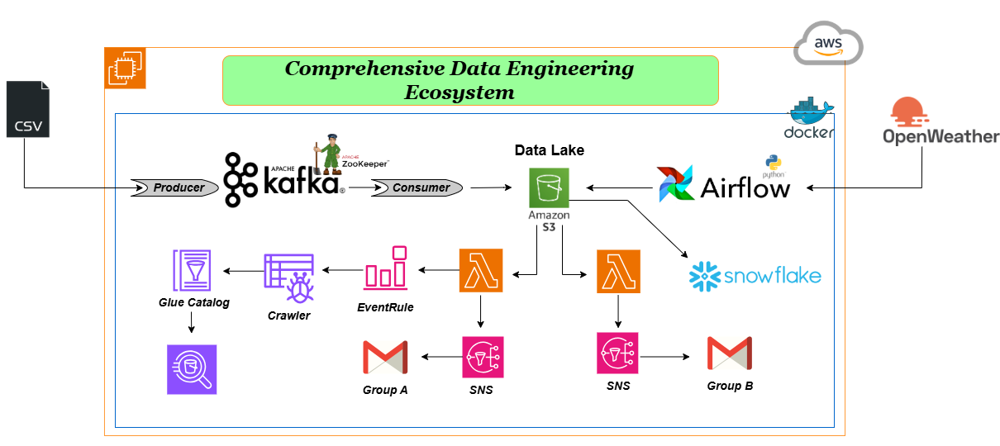

# Comprehensive Data Engineering Ecosystem

## Diagram

---

## Overview
This project demonstrates a robust and scalable data engineering ecosystem that integrates multiple tools and technologies to process, analyze, and manage data efficiently. The architecture supports real-time and batch data processing, leveraging modern data engineering best practices.

---

## Architecture

### 1. **Data Ingestion**
   - **CSV Input**: Data ingestion begins with a CSV file upload.
   - **Apache Kafka**: A Kafka producer ingests the data and streams it into the ecosystem.
     - **Producer**: Publishes data to Kafka topics.
     - **Consumer**: Listens to topics and processes the data.
   - **ZooKeeper**: Manages and coordinates Kafka cluster services.

---

### 2. **Data Storage**
   - **Amazon S3 (Data Lake)**: The central storage location where raw, processed, and transformed data resides. S3 serves as the backbone for downstream processing.

---

### 3. **Data Transformation**
   - **Apache Airflow**:
     - Orchestrates workflows for extracting data, transforming it, and loading it into Snowflake.
     - Integrates with external APIs like OpenWeather for additional data sources.
   - **AWS Glue**:
     - **Glue Crawler**: Crawls the data lake to update the Glue Data Catalog.
     - **Glue Catalog**: Stores metadata for efficient querying and transformations.

---

### 4. **Data Processing and Notifications**
   - **AWS Lambda**:
     - Processes data changes and triggers events.
     - Sends notifications when specific actions occur, such as new file uploads.
   - **Amazon SNS**:
     - Sends notifications to different user groups:
       - **Group A**: Receives notifications for specific events.
       - **Group B**: Informed about processed data and updates.

---

### 5. **Data Analytics**
   - **Snowflake**: 
     - Acts as the data warehouse for performing advanced analytics on processed data.
   - **External API Integration**:
     - OpenWeather API fetches additional data for analytics and decision-making.

---

## Key Features
- Real-time data streaming and processing.
- Centralized data storage in a scalable S3-based data lake.
- Workflow orchestration and automation with Apache Airflow.
- Metadata management and schema detection using AWS Glue.
- Notifications via Amazon SNS for event-driven updates.
- Advanced analytics capabilities with Snowflake integration.

---

## Tools & Technologies Used
- **Apache Kafka & ZooKeeper**
- **Amazon S3, AWS Lambda, AWS Glue, Amazon SNS**
- **Apache Airflow**
- **Snowflake**
- **OpenWeather API**
- **Docker**

---

## How It Works
1. Data is ingested into the system via CSV files and Apache Kafka.
2. Kafka streams the data to Amazon S3, where it is stored as part of the data lake.
3. AWS Glue crawlers update the Glue Catalog for metadata management.
4. Apache Airflow orchestrates workflows for ETL tasks and API integration.
5. AWS Lambda triggers notifications via SNS groups upon file uploads or specific events.
6. Snowflake serves as the data warehouse for advanced analytics.

